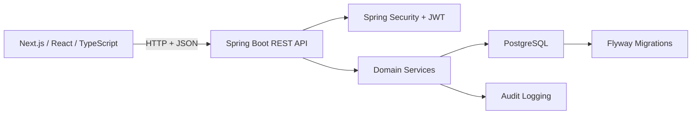

# Pesa Bank

[](https://github.com/KigenIsaac/pesa-bank/actions/workflows/ci.yml)

Pesa Bank is a modular digital banking application prototype built with a **Spring Boot 3 backend** and **Next.js 14 frontend**. It models customer banking, teller operations, administration, KYC, payments, notifications, support, auditing, and role-based security.

> **Portfolio project:** This is a learning and demonstration system, not a production banking platform.

## What it demonstrates

- Layered Spring Boot backend with domain, repository, service, and web layers
- JWT authentication with BCrypt password hashing and role-based authorization
- Customer, teller, and administrator workflows
- Account balances, deposits, withdrawals, transfers, reversals, and transaction history
- KYC submission and review workflows
- Teller till and end-of-day reporting concepts
- Payment/payee management
- Notifications and customer support tickets
- Audit logging
- PostgreSQL persistence and Flyway migrations
- Next.js App Router frontend with TypeScript
- Optimistic locking for concurrent entity updates
- Automated backend tests and frontend type-check/build verification

## Architecture



### Backend modules

```text
co.ke.pesabank
├── admin
├── customer
├── kyc
├── notification
├── payee
├── security
├── shared
├── support
└── teller
```

Each major module follows the same general separation:

```text
web/controller → service → repository → database
                    ↓
                  domain
```

## Tech stack

### Backend

- Java 21
- Spring Boot 3.3.4
- Spring Security
- Spring Data JPA / Hibernate
- PostgreSQL
- Flyway
- JJWT
- BCrypt
- Maven

### Frontend

- Next.js 14.2
- React 18
- TypeScript
- App Router
- npm

## Repository structure

```text
pesa-bank/
├── backend/
│   ├── src/main/java/co/ke/pesabank/
│   ├── src/main/resources/
│   │   └── db/migration/
│   └── pom.xml
├── frontend/
│   ├── app/
│   ├── components/
│   ├── lib/
│   └── package.json
├── .env.example
├── .github/workflows/ci.yml
├── .gitignore
└── README.md
```

## Prerequisites

- Java 21+
- Maven 3.9+
- Node.js 20+
- npm
- PostgreSQL 14+

## Configuration

Copy the environment template and replace the placeholder values:

```bash
cp .env.example .env
```

The important variables are:

```text
DB_HOST
DB_PORT
DB_NAME
DB_USER
DB_PASSWORD
JWT_SECRET
JWT_EXPIRATION_MINUTES
CORS_ORIGINS
SEED_ENABLED
SEED_PASSWORD
```

**Demo seeding is disabled by default.** If you intentionally enable it for a local demonstration:

```text
SEED_ENABLED=true
SEED_PASSWORD=<your-local-demo-password>
```

The seed creates demo users for the customer, teller, and admin roles. The password is supplied through configuration and is never stored in source control or logged.

## Database

Create a PostgreSQL database matching your environment configuration:

```text
pesabank
```

Database migrations are stored in:

```text
backend/src/main/resources/db/migration/
```

Production configuration enables Flyway and validates the JPA schema.

## Run locally

### Backend

```bash
cd backend
mvn clean test
mvn spring-boot:run
```

Backend:

```text
http://localhost:8080
```

### Frontend

In another terminal:

```bash
cd frontend
npm ci
npm run dev
```

Frontend:

```text
http://localhost:3000
```

## Testing and verification

Backend unit tests:

```bash
cd backend
mvn test
```

Frontend type-check:

```bash
cd frontend
npx tsc --noEmit
```

Frontend production build:

```bash
cd frontend
npm run build
```

GitHub Actions runs these checks automatically on pushes and pull requests to `master`.

## Clean-start demo walkthrough

For a complete local demonstration, use a fresh PostgreSQL database and intentionally enable the demo seed so the workflow has an administrator and teller available to review and fund a newly registered customer.

1. Configure `SEED_ENABLED=true` and a local `SEED_PASSWORD`.
2. Start PostgreSQL and the Spring Boot backend.
3. Start the Next.js frontend.
4. Register a new customer from `/register`.
5. Complete the KYC form from the customer dashboard.
6. Sign in as the seeded administrator and open **KYC review**.
7. Approve the customer's KYC.
8. Return to the customer account and open a **Savings** or **Current** account.
9. Sign in as the seeded teller and open a till.
10. Search for the customer's account number and make a cash deposit.
11. Return to the customer account and verify the new balance and transaction.
12. Use the transfer or payments screens to exercise a funded account.
13. Download a statement to verify the resulting ledger entries.

The seeded administrator and teller exist only to make the local demonstration workflow testable. Keep demo seeding disabled in production.

## Security model

The application uses:

- Stateless JWT authentication
- BCrypt password hashing
- Role-based endpoint authorization
- Active-user checks during JWT authentication
- Server-side account ownership checks
- Validation of incoming request payloads
- Centralized API error handling
- CORS configuration
- Optimistic locking for persisted entities
- Audit records for important user actions

This project intentionally does **not** claim to implement the controls required for a real financial institution, such as full regulatory compliance, production key management, fraud detection, hardware-backed secrets, high-availability infrastructure, or comprehensive security testing.

## Main workflows

### Customer

- Register and authenticate
- View accounts and balances
- View statements and transactions
- Transfer funds
- Make payment requests
- Submit and track KYC
- View notifications
- Open support tickets
- Manage profile/security settings

### Teller

- Customer lookup
- Deposits and withdrawals
- Transfers
- Till management
- Reversals
- End-of-day reporting

### Administrator

- User management
- Transaction oversight
- Reversal review
- KYC review
- Compliance alerts
- Audit inspection
- Reports
- Bank settings

## Engineering notes

### Transaction consistency

Money-changing operations execute inside Spring transactions. Account entities also use optimistic locking so concurrent updates can be detected instead of silently overwriting a newer entity version.

### Production boundary

Pesa Bank is deliberately presented as a **banking-system prototype**. It demonstrates architecture and engineering practices without pretending to be safe for real customer funds.

## License

No open-source license is currently declared. The repository is publicly viewable for portfolio and demonstration purposes.
